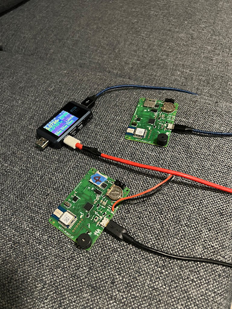
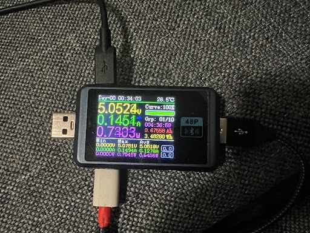
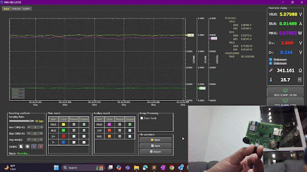
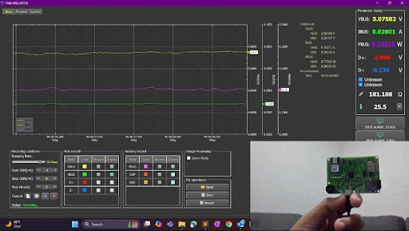

# Wake-on-UWB

The repository is adopted with some modifications by Prof. Ashutosh Dhekne and his Lab from [https://github.com/thotro/arduino-dw1000](https://github.com/thotro/arduino-dw1000).

For more details on source repository, please refer [source_README.md](source_README.md).

We modified [RangingTag.ino](examples/RangingTag/RangingTag.ino) to perform Two-Way Ranging (TWR) only when motion is detected by IMU Sensor. This saves us power by not doing TWR when device is stationary which makes sense because location of device is not going to change at all, so we don't need to continuously measure the location of the device all the time.

## Setup Instructions
- Download Arduino IDE
- The board we used was based on Adafruit Feather M0. Instructions to setup Arduino for that board are given [here](https://learn.adafruit.com/adafruit-feather-m0-basic-proto/setup).

## Run Instructions
We would need 2 boards to run our script. 1 board will install [RangingTag.ino](examples/RangingTag/RangingTag.ino) file and another board will install [RangingAnchor.ino](examples/RangingAnchor/RangingAnchor.ino) file.
- Open [RangingTag.ino](examples/RangingTag/RangingTag.ino) and install it on board 1.
- Open [RangingAnchor.ino](examples/RangingAnchor/RangingAnchor.ino) and install it on board 2.
- Launch serial monitor for both the boards on Arduino IDE.
- Lift board 1 and move it around randomly in non-uniform velocity.
- You will see TWR being performed between board 1 & 2.
- Now place the board 1 back on the table. TWR will stop and board 1 will go to deep sleep.

## States Supported
We currently support 2 states on Ranging Tag.
1. Deep Sleep: Here UWB sensor on board goes to sleep and consumes low power.
2. Idle: UWB sensor does not tranmit or receive any signals, but is still awake. It consumes higher power but still less than actual transmission.

To modify these states, please modify `sleep_type` variable at line 82 of [RangingTag.ino](examples/RangingTag/RangingTag.ino).

## Power Measurement
We also had a third device (FNIRSI USB Tester) to measure power consumption when board is asleep compared to when it is doing transmission.

To measure power simply connect the USB Tester with board 1 (i.e., RangingTag), and connect the USB Tester to laptop. You will see the readings on the power measuring device itself as shown in above screenshot.

To further plot the graphs when power is being measured, install FNIRSI USB Tester from this [website](https://fnirsi.com/pages/software?srsltid=AfmBOop1ni8fPXsU__Wkx92gbpVZN43U4pW5O9PuCiZe_OiUnLuzoTtP) under the title *C1 / FNB48S / FNB48P / FNB58 Software Download*. We used this [link](https://www.mediafire.com/file/5hvgsrlps2ceqlu/FNIRSI-%25E6%25B5%258B%25E8%25AF%2595%25E4%25BB%25AA%25E4%25B8%258A%25E4%25BD%25) to download PC app on Windows 11.

Furthermore, for the plots to be visible on the USB Tester App, we will need to connect one more data cable from USB Tester device to laptop to transfer the measured data to laptop for plotting.

## Results

We measured power consumption across 2 different states `DEEP SLEEP` and `IDLE`, and results are shown in table below:

| State | Power (W) |
| ------|---------- |
| Tx/Rx | 0.74      |
| Idle  | 0.14      |
| Deep Sleep | 0.075 |

We also measured wakeup latency once motion is detected from both of these states. We also measured latency to perform TWR. Results shown in table below:

| Action | Latency (ms) |
|--------|--------------|
|Wakeup from Deep Sleep| 42.53 |
|Wakeup from IDLE | 0.23 |
|TWR | 21.16 |

Finally, we show the power measurement graphs observed on USB Tester:

### Deep Sleep

### Idle

